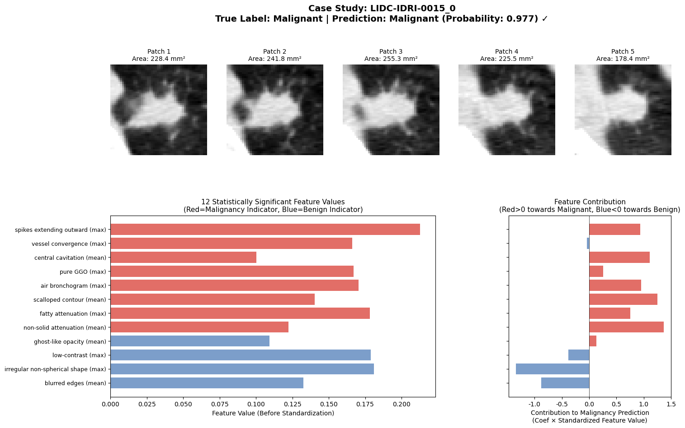

# LIDC-IDRI Patch Research

Interpretable Lung Nodule Malignancy Prediction Based on ConceptCLIP



## Project Overview

This project explores the use of **ConceptCLIP** (a vision-language model for the biomedical domain) for lung nodule benign/malignant classification. The core approach is:

1. **Zero-shot Feature Extraction**: Using pre-trained ConceptCLIP model without fine-tuning
2. **Concept-driven**: Defining radiological concepts (e.g., spiculation, lobulation, calcification) and computing image-concept similarity scores
3. **Interpretability**: Using simple logistic regression models to quantify each concept's contribution to predictions through feature coefficients

### Research Questions

- **RQ1**: How to design effective radiological concepts to improve downstream classification performance?
- **RQ2**: Do the concept representations learned by ConceptCLIP have clinical interpretability?

### Main Results

- 20-concept configuration achieves optimal performance: **AUC=0.794, Accuracy=0.730**
- **12 statistically significant concept features** identified through L1 regularization feature selection
- All significant features are consistent with clinical knowledge

## Dataset

Using the **LIDC-IDRI** dataset to construct nodule-level 2D patch dataset:

- **Number of Nodules**: 678 (Malignant: 397, Benign: 281)
- **Number of Patients**: 440
- **Number of Images**: 2532 patches

Dataset construction code: [LIDC-IDRI_patch_generation](https://github.com/aquamarineaqua/LIDC-IDRI_patch_generation)

## Project Structure

```
LIDC-IDRI_patch_research/
├── 1_Database_and_Dataloader_create.ipynb  # Data preprocessing and feature extraction
├── 2_Read_database.ipynb                    # Read database and basic classification
├── 3_For_20_concept.ipynb                   # 20-concept experiment
├── 4_For_30_concept.ipynb                   # 30-concept experiment
├── 5_For_image_embeddings.ipynb             # Image embedding baseline experiment
├── 6_For_20_concept_L1_feature_selection.ipynb  # L1 feature selection and interpretability analysis
└── datasets/                                # Dataset folder
    └── curation2/lidc_patches_all/          # Patch image data (please extract the compressed file yourself)
```

## Installation

### Python Version
- Python >= 3.10

### Required Libraries

```bash
pip install torch torchvision transformers huggingface_hub pandas numpy matplotlib scikit-learn statsmodels h5py tqdm pillow seaborn jupyter
```

## Usage Guide

### 1. Data Preparation

Ensure the `datasets/curation2/lidc_patches_all/` directory contains:
- `all_patches_metadata.csv`: Metadata file
- Patient folders (e.g., `LIDC-IDRI-0001/`): Containing patch images

**Note**: First-time run requires HuggingFace login:
```python
from huggingface_hub import login
login(token="YOUR_HUGGINGFACE_TOKEN")
```

### 2. Notebook Descriptions

| Notebook | Description |
|----------|-------------|
| `1_Database_and_Dataloader_create.ipynb` | **Data preprocessing and feature extraction pipeline**: Filter nodules with area ≥50mm², binary label generation, load ConceptCLIP to extract image/text features, store to HDF5 database |
| `2_Read_database.ipynb` | **Basic classification experiment (10 concepts)**: Read HDF5 features, Prompt Ensembling, compute concept scores, nodule-level aggregation, 5-fold cross-validation logistic regression |
| `3_For_20_concept.ipynb` | **20-concept experiment**: Define 20 radiological concept categories (98 sub-concepts), generate text embeddings, image-concept similarity computation, classification evaluation |
| `4_For_30_concept.ipynb` | **30-concept experiment**: Extend to 30 concept categories (145 sub-concepts), compare classification performance across different concept numbers |
| `5_For_image_embeddings.ipynb` | **Baseline experiment**: Classification using pure image embeddings (Mean-Max concatenation, 2304 dimensions), compare Logistic Regression, SVM, XGBoost |
| `6_For_20_concept_L1_feature_selection.ipynb` | **Feature selection and interpretability analysis**: LASSO feature selection, statistical significance testing (p-value), Bootstrap stability assessment, Case Study visualization |

### 3. Recommended Workflow

```
Step 1: Data Preprocessing
└── 1_Database_and_Dataloader_create.ipynb
    ├── Output: curated_metadata.csv
    └── Output: conceptclip_features.h5

Step 2: Concept Experiments
├── 2_Read_database.ipynb (10 concepts)
├── 4_For_30_concept.ipynb
└── 3_For_20_concept.ipynb

Step 3: Interpretability Analysis
└── 6_For_20_concept_L1_feature_selection.ipynb
    ├── LASSO Feature Selection
    ├── Statistical Testing
    └── Case Study Visualization

(Optional) Baseline Comparison
└── 5_For_image_embeddings.ipynb
```

### 4. Output Files Description

| File | Description |
|------|-------------|
| `curated_metadata.csv` | Curated metadata |
| `conceptclip_features.h5` | Original 10-concept feature database |
| `conceptclip_features_20.h5` | 20-concept feature database |
| `conceptclip_features_30.h5` | 30-concept feature database |
| `image_features/df_image_features.csv` | Image embedding features |
| `image_features/df_nodule_features_concept20_minmax.csv` | Nodule-level concept scores |

